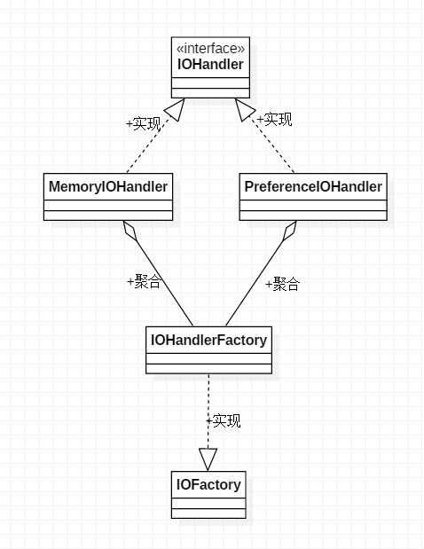

[TOC]

# 工厂设计模式(生产对象)
> 定义一个创建对象的接口，让子类决定实例化哪个类，儿对象的创建统一交由工厂去生成，有良好的封装性，既做到了解耦也保证了最少知识原则。

**任何设计模式都是用来解决某一些特定场景问题的一种思想**

## 简单工厂模式
> 如果要新增就需要不断的去修改原来的代码，可以使用工厂方法模式

## 工厂方法模式
> 一个工厂生产一个对应的产品

**问题：随着功能的扩展，IOFactory类会不断的增加，而且基本逻辑一样，比较冗余，就需要使用抽象工厂模式了。**

## 抽象工厂模式
> 与BitmapFactory比较像，通过特定的方法返回单一的对象

## 使用场景
> 很多对象有共性，并且后期可能存在多样性，还不想让人知道创建细节，创建过程较为复杂。
地图，图片

## 源码中

* BitmapFactory
* XmPullParseFactory
* LayoutInflateFactory
